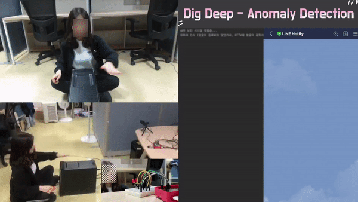

# Abnormal Detection for Corporate Internal Security
This project aims to prevent corporate internal security (especially data leakage through storage device) using customized YOLOv3.  You can find referenced code [here](https://github.com/eriklindernoren/PyTorch-YOLOv3). 

> Our code is not provided due to security concerns and it is Enterprise Cooperation Project.

## Demo

## Dataset
The dataset is about 9,000 images included a total of 12 PCs and 5 people.
Using **YOLO-v3**, I used images to insert a storage device (such as USB) into a PC.

## Classes
Three out of five people were recognized through **face recognition**  and we call these ***insider***.
*- We pre-trained the face recognition model to recognize the faces of these three people.*
And the other two people, we call them ***outsider***. 

In the dataset,  we cropped unfixed pixels that someone inserts a storage device into a PC visibly. We defined this class as **'PC_Vis**'.
If a device is inserted invisibly, We defined this class as **'PC_Invis**.

Likewise, If a device is inserted into a laptop, We defined as **'Laptop_Vis'** and **'Laptop_Invis'**.

## Customize
Face recognition was performed with YOLO-v3.
When a face is detected by YOLO-v3 (Does not distinguish who it is.), it determines whether it is an insider by calling a function of **face recognition**.
We just customized the YOLO-v3 model using only 5 classes (**PC_Vis**, **PC_Invis**, **Laptop_Vis**, **Laptop_Invis**, **Face**).

## Additional work
Additionally, a cam was connected to the Raspberry Pi to detect in real time. As soon as abnormal behavior is detected, a buzzer sounds on the Raspberry Pi.

## Related papers
[*YOLOv3: An Incremental Improvement by Joseph Redmon*](https://arxiv.org/abs/1804.02767)
[*You Only Look Once: Unified, Real-Time Object Detection by Joseph Redmon*](https://arxiv.org/abs/1506.02640)

## Author
Jungseob Lee / [ js-lee-AI](https://github.com/js-lee-AI) / omanma1928@naver.com
Juhoon Kim / [galaxy1014](https://github.com/galaxy1014) / galaxy1014@naver.com
